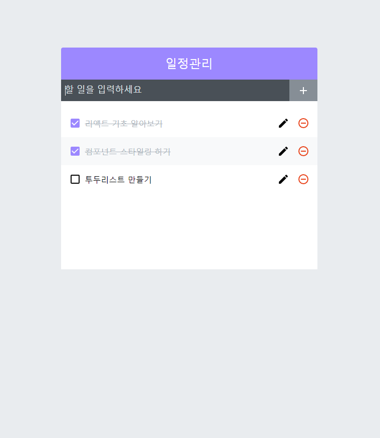
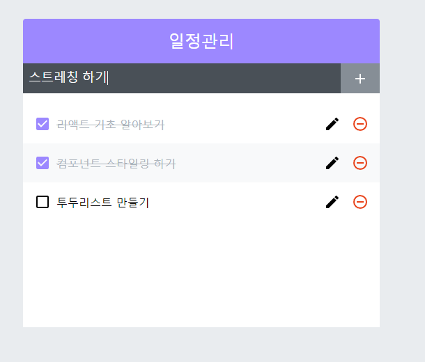
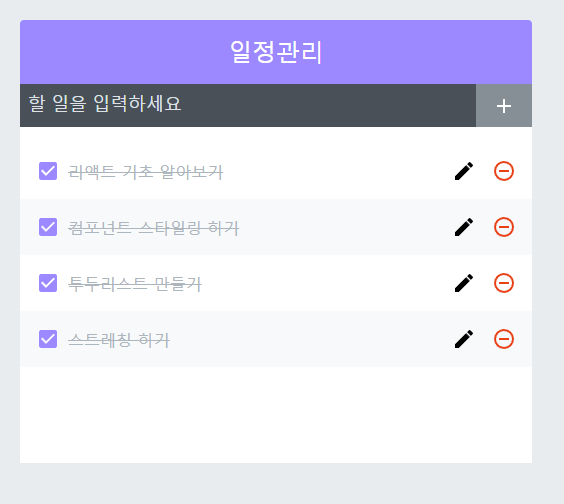
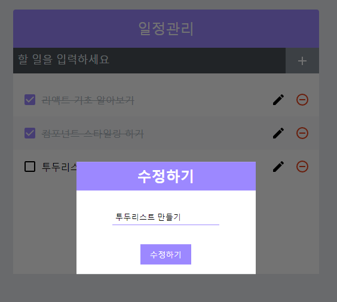
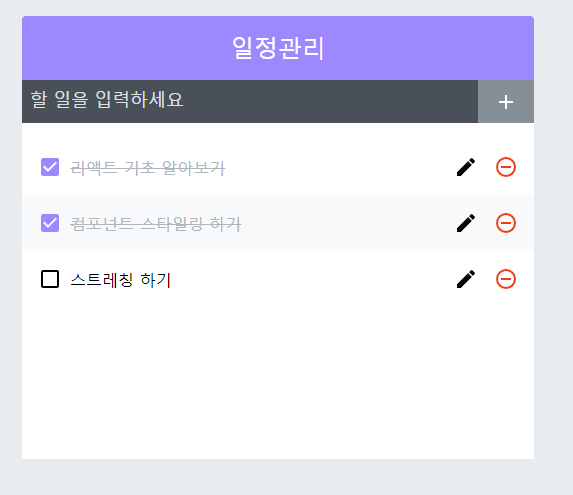

# 간단한 투두리스트 만들기 제작
>바로가기 https://soonmac.github.io/react-todolist

## 프로젝트 목표
* React와 SCSS를 이용하여 간단한 CRUD 기능이 있는 투두리스트 앱 구현
## 프로젝트에 사용한 기술
### React
* useState, useRef, useCallback 등의 리액트 훅을 사용함
* React.memo, react-virtualized를 사용하여 렌더링 최적화
### SCSS
* nesting(중첩)을 이용해 최적화된 스타일 작성

## 프로젝트의 기능 설명
각 기능에 대한 코드 설명은 블로그에 포스팅했습니다.
📎[[React] 간단한 투두리스트 만들기](https://velog.io/@soonmac/React-%EA%B0%84%EB%8B%A8%ED%95%9C-%ED%88%AC%EB%91%90%EB%A6%AC%EC%8A%A4%ED%8A%B8-%EB%A7%8C%EB%93%A4%EA%B8%B0)
### 할 일 추가

상단의 Input에 텍스트를 적고 Enter키 혹은 오른쪽의 + 버튼을 누르면 할 일이 목록에 저장됩니다. 

### 체크 기능

텍스트를 클릭하면 체크됩니다. 

### 수정 기능

오른쪽의 연필 아이콘을 클릭하면 수정하기 팝업창이 뜹니다.
Input에 텍스트를 수정 및 입력하고 수정하기 버튼 혹은 엔터키를 입력하면 할 일의 텍스트가 수정됩니다.

### 삭제 기능

오른쪽의 빨간색 아이콘을 클릭하면 해당 할 일이 삭제됩니다.

## 참고
* 리액트를 다루는 기술(김민준 지음, 길벗)
* [[React로 Todo App 만들기] 4. Update와 Delete 기능 개발](https://www.youtube.com/watch?v=51zgTcx3_9w&list=PLyjjOwsFAe8J9tqYqO_y7Fr6FTSncZQZI) - 개린이르라나 유튜브 채널
